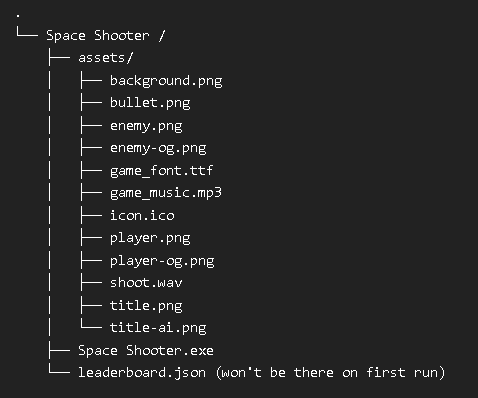

# Space Shooter Game

A fun, 2D space shooter game built using Python and Pygame. The player controls a wizard shooting at enemies, avoiding obstacles, and collecting points. The game features multiple levels and a leaderboard.

## Features
- Simple and addictive gameplay
- Player character: Wizard
- Enemies: Roaches and other bug variants
- Levels: Kitchen, Wizard Chamber, Dumpster
- Game Over screen with option to restart
- Score tracking and leaderboard
- Background and title images

## Requirements
- Python 3.x
- Pygame 2.x

## Installation Method One (Cloning)

1. Clone the repository:
   ```bash
   git clone https://github.com/oxyoxy1/space-shooter.git
   cd space-shooter
   ```

2. Install dependencies:
   ```bash
   pip install -r requirements.txt
   ```

3. Run the game:
   ```bash
   python main.py
   ```

## Installation Method Two (Binary)

1. Download binaries + assets
2. Arrange as so:
   
3. Run Space Shooter.exe
---

### `requirements.txt`
   ```text
   pygame==2.6.1
   ```

.gitignore
```text
# Python bytecode files
__pycache__/
*.pyc
*.pyo

# Pygame and other generated files
*.log
*.bak
*.swp

# Virtual environment folder
venv/

# VSCode settings
.vscode/

# Windows system files
Thumbs.db
Desktop.ini

# Mac system files
.DS_Store
```
LICENSE
```bash
MIT License

Copyright (c) 2025 [Kenneth Gauthier]

Permission is hereby granted, free of charge, to any person obtaining a copy
of this software and associated documentation files (the "Software"), to deal
in the Software without restriction, including without limitation the rights
to use, copy, modify, merge, publish, distribute, sublicense, and/or sell
copies of the Software, and to permit persons to whom the Software is
furnished to do so, subject to the following conditions:

The above copyright notice and this permission notice shall be included in all
copies or substantial portions of the Software.

THE SOFTWARE IS PROVIDED "AS IS", WITHOUT WARRANTY OF ANY KIND, EXPRESS OR
IMPLIED, INCLUDING BUT NOT LIMITED TO THE WARRANTIES OF MERCHANTABILITY,
FITNESS FOR A PARTICULAR PURPOSE AND NONINFRINGEMENT. IN NO EVENT SHALL THE
AUTHORS OR COPYRIGHT HOLDERS BE LIABLE FOR ANY CLAIM, DAMAGES OR OTHER
LIABILITY, WHETHER IN AN ACTION OF CONTRACT, TORT OR OTHERWISE, ARISING FROM,
OUT OF OR IN CONNECTION WITH THE SOFTWARE OR THE USE OR OTHER DEALINGS IN THE
SOFTWARE.
```

How to Use:
Clone the repository and open the project folder in your terminal.

Install dependencies using the requirements.txt file by running the following:
```bash
pip install -r requirements.txt
```

Run the game:

```bash
python main.py
```
